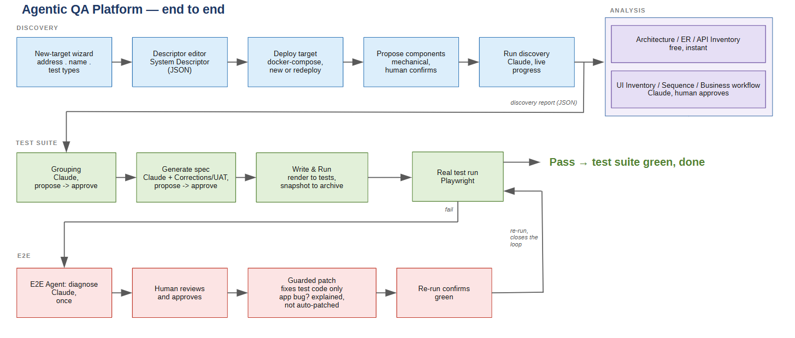
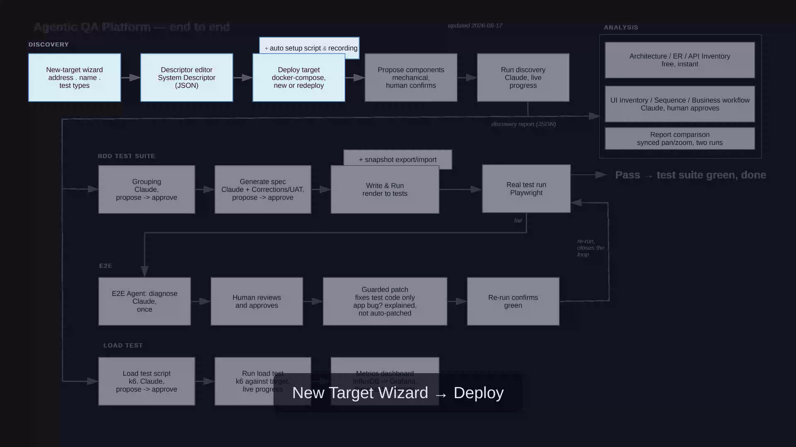

# Agentic QA Platform

[](https://github.com/alexandrkotov) [](LICENSE)                

An SDET and AI-automation portfolio project, built around a real containerized order-processing
app, **OrderFlow** (backend + frontend + Postgres + Kafka).

It combines a deterministic Playwright + Gherkin/BDD regression suite (generated by AI, then
hand-hardened — currently 20 scenarios against **Uptime Kuma**, a real external target this
project was never built for; OrderFlow's own suite is preserved too, see "The test suite" below)
with a **human-supervised, closed-loop E2E Agent** that runs that
suite for real, and — only on failure — asks Claude to diagnose why and propose a fix a human can
review and approve before anything is applied.

Claude is the default provider for every agent; OpenAI is supported through the same provider
abstraction, mainly to compare the two on the same task (see
[`agent-service/README.md`](agent-service/README.md)).

> Running tests doesn't need AI. The interesting part is what happens after a real failure.

What this actually proves:

- An AI agent explores an unfamiliar system (UI + API + database) on its own and writes a
  real, executable BDD test suite from what it finds.
- Not tuned to one app: proven on 6 real, unrelated open-source apps it had never seen before —
  [wger](https://github.com/wger-project/wger), Uptime Kuma, Snipe-IT, Wekan, nopCommerce, and
  NocoDB — each deployed straight from its own repo with a one-click "Deploy target" action. Five
  of them each prove out a different database engine (Postgres, MySQL, MongoDB, MS SQL, SQLite);
  NocoDB is the flagship video's own target below, not a permanent fixture in this repo. See
  "The System Descriptor" below.
- Test results stay deterministic — pass/fail always comes from the test's real exit code,
  never an LLM's opinion.
- The AI is only called in after a real failure, to diagnose why (app bug / test bug /
  environment issue / stale test data / tool crash / unknown).
- Guardrails are enforced in code, not just in the prompt.
- Every proposed fix is inspected and explicitly approved by a human before anything changes
  — nothing commits or pushes itself, at any stage.
- The whole stack runs in Docker, verified on a real GitHub Actions runner, not just locally.

See [docs/phase2-status.md](docs/phase2-status.md), [docs/phase3-status.md](docs/phase3-status.md), and
[docs/phase4-status.md](docs/phase4-status.md) for the detailed, warts-and-all account of how that went.

### E2E Agent in action

A real, unedited run: a test scenario is deliberately broken, the agent runs the real Playwright
suite, gets a real failure, calls Claude once to diagnose it, and only applies the fix after an
explicit human `y` — then re-runs the real suite to confirm it's green. No auto-commit.


### How the pieces fit together

Start to finish — from onboarding a brand-new target system through to a self-healing test suite:



**Full video walkthrough** — a real, unscripted run against NocoDB (a real open-source app,
never built for by this project) from a bare GitHub link to a passing test suite and a live
load-test dashboard:

[](https://youtu.be/GR7R2_znkqA)

Discovery and Generate run once to bootstrap a suite (already committed for every target this repo
ships, e.g. OrderFlow and Uptime Kuma — you don't need to re-run them); the E2E Agent then runs
against that suite for real, any time, on demand, closing the loop by re-verifying its own guarded
patch actually fixed the failure. Analysis and Load Test are both optional and don't block anything
downstream — Analysis exists purely to help a human understand what Discovery found, and Load Test
runs against a deployed target independently of the functional test suite.

## What's in this repo

### The application under test

**OrderFlow below is this repo's own bundled example — not the only thing under test anymore.**
It's its own compose project (`bdd-target-demo-orderflow`, alongside the platform's own
`docker-compose.yml` — see "Running this locally" below), independently deployable/tearable-down,
and its own suite is preserved and restorable any time (see "The test suite" below). The same
pipeline, unmodified, also runs against the external apps named above (see "The System Descriptor"
below) — right now it's actually one of those, Uptime Kuma, whose suite `tests/.current-descriptor`
names.

Not a Todo list — a small order-processing app, **OrderFlow**, chosen specifically because it creates
real relationships across layers to test against: `Customer` → `Order` → `OrderItem` → `Product`,
plus an `OrderStatusHistory` audit trail (`DRAFT → SUBMITTED`). That shape opens up test
scenarios a Todo app can't: does the order total match the sum of its items, does deleting a
product break existing orders that reference it, does a status change in the UI actually get
written to the database and reflected back in the API response, is a duplicate customer email
rejected, do business rules hold consistently across both the UI and the API.

The backend also publishes an `orders.status-changed` event to Kafka on every order creation and
status change (same moments that already write to `OrderStatusHistory`) — a real, best-effort
side channel (a Kafka outage never blocks the request), not demo data seeded by hand.

| Part | Stack | Path |
|---|---|---|
| Backend | NestJS + TypeScript, Prisma ORM, OpenAPI/Swagger at `/docs` | [`app/`](app/) |
| Database | PostgreSQL 16 | (via `docker-compose.yml`) |
| Frontend | React 19 + TypeScript + Tailwind | [`frontend/`](frontend/) |
| Events | Kafka (single-node KRaft, `apache/kafka`) + `provectuslabs/kafka-ui` at `:8081` | (via `docker-compose.yml`) |

### The agents

| Agent | Role | Path |
|---|---|---|
| **System Discovery Agent** | Explores a *live* target system — described declaratively by a **System Descriptor** (JSON, see below), not hardcoded — using a real agentic tool-use loop, including a real write scenario to observe actual behavior. Produces a structured discovery report (schema/endpoints/UI pages/topics, business rules, candidate test scenarios). | [`agent-service/src/bootstrap/discovery.ts`](agent-service/src/bootstrap/discovery.ts) |
| **Generate** | Turns that discovery report into a Playwright + `playwright-bdd` test suite (`.feature` + `.steps.ts`) through a three-stage, human-approved pipeline: deterministic grouping, one Claude call per group that writes the real Gherkin/step text directly (checked deterministically before review, not just trusted), then a plain write-to-disk stage. No stage runs on top of the previous one's output until a human approves it. | [`agent-service/src/agents/generate/`](agent-service/src/agents/generate/) |
| **E2E Agent** | Runs a real Playwright scenario, diagnoses only actual failures (via Claude, once), and applies an exact guarded patch only after explicit human approval. | [`agent-service/src/agents/e2e/`](agent-service/src/agents/e2e/) |
| **Load** | Runs a k6 script against a target's REST API — backend/HTTP load only, no browser rendering — producing request-rate/latency/error-rate metrics in a shared Grafana dashboard. Can optionally have Claude write the script from a discovery report, human-approved (and k6-validated) before it's ever saved or run. Descriptor-agnostic — any target with a `rest-api` component works, not just OrderFlow. | [`agent-service/src/agents/loadtest/`](agent-service/src/agents/loadtest/), [`loadtests/`](loadtests/) |

**Generate** turns a discovery report into real Gherkin + Playwright step code through three
human-approved CLI stages (group → spec → render) — a deterministic checker (`verify.ts`) catches
step-pattern ambiguity, handler-arity mismatches, and cross-group collisions before a human ever
reviews it, not just trusts the model's output. **E2E** runs a real scenario, and only on a real
failure calls Claude once to classify the cause (`application_bug` / `test_bug` /
`environment_issue` / `test_data_issue` / `tool_error` / `unknown`) and propose a fix — applied
only after an explicit human `y`, then re-verified with no further AI involvement. Guardrails (no
touching `app/`/`frontend/`, no patch when the cause is an app bug, exact-match-only edits) are
enforced in code, not just prompted. Full stage-by-stage mechanics, every guardrail adversarially
tested, and the redesign history — why the old hardcoded-domain Generate had to go, with real
evidence, not a hypothetical: [docs/phase4-status.md](docs/phase4-status.md) (E2E) and
[docs/phase5-status.md](docs/phase5-status.md) (Generate).

A real (trimmed) diagnosis — the same `orders.feature` scenario's expected status deliberately
changed to `"SUBMITTED_WRONG"`, run for real against OrderFlow's own archived suite, caught and
correctly classified as a test bug, not an app bug:

```json
{
  "scenarioId": "submit-draft-order",
  "status": "failed",
  "diagnosis": {
    "classification": "test_bug",
    "confidence": "high",
    "reasoning": "The error message clearly shows that the test expected the order status to be \"SUBMITTED_WRONG\" but received \"SUBMITTED\". Looking at the feature file, the assertion is: `Then the order status should be \"SUBMITTED_WRONG\"`. This is obviously an incorrect expected value in the test — the scenario is testing that submitting a DRAFT order changes its status to SUBMITTED, not \"SUBMITTED_WRONG\". The application correctly returns \"SUBMITTED\" status after the order is submitted.",
    "structuredFix": {
      "filePath": "features/orders.feature",
      "oldText": "Then the order status should be \"SUBMITTED_WRONG\"",
      "newText": "Then the order status should be \"SUBMITTED\""
    }
  }
}
```

All agents are **independent, manually-triggered tools** — run it, get an artifact, a human takes
it from there — not steps in an automated pipeline; none is invoked by the test suite itself or by
CI. See [`agent-service/README.md`](agent-service/README.md) for the full technical reference:
provider abstraction, MCP tool configs, how to add a new tool/phase/target, Claude-vs-OpenAI
comparison.

Every AI call, from any agent, is logged with its token usage and (where priced) its cost to a
persistent local report, viewable live at `http://localhost:8080/usage/` (served by the same
`report` container as the test report below).

### The System Descriptor

What the System Discovery Agent above explores is a JSON file, not code — a **System
Descriptor** ([`agent-service/src/descriptor/schema.ts`](agent-service/src/descriptor/schema.ts),
validated with zod) describing a target system as a list of typed components:

| Component | Fields | What it gets discovery access to |
|---|---|---|
| `postgres` | `connectionString` | Schema + sample rows, via `@modelcontextprotocol/server-postgres` |
| `mysql` | `connectionString` | Read-only `SELECT`/`SHOW`/`DESCRIBE` queries, via a hand-written tool (no official MCP server exists for MySQL/MariaDB) |
| `mongo` | `connectionString` | Schema + sample docs, via the official `mongodb-mcp-server` |
| `mssql` | `connectionString` | Read-only `SELECT` queries, via a hand-written tool (same reasoning as `mysql`) |
| `sqlite` | `path` (a `.db` file, `${HOST_PROJECT_ROOT}`-relative — see `agent-service/README.md`) | Read-only queries against a docker-compose-deployed target's own bind-mounted `.db` file, via the real `sqlite3` CLI |
| `rest-api` | `swaggerUrl` (or `knownEndpoints` when no spec exists), optional `baseUrl`, optional `headers` (static auth headers, e.g. an API token) | The full OpenAPI spec, or a hand-verified endpoint list |
| `web-ui` | `baseUrl`, `routes` | Live browser navigation, via Playwright MCP |
| `kafka` | `brokers`, optional `sasl`/`tls` | Whole-broker exploration — topics, configs, sample messages, consumer groups, via [`tuannvm/kafka-mcp-server`](https://github.com/tuannvm/kafka-mcp-server) |
| `kafka-consumer` | `brokers`, `topic`, optional `sampleSize` | One named topic only — message count, inferred payload shape, anomalies (same MCP server, narrower prompt) |
| `docker-compose` | `repoUrl`, optional `ref`/`composeFile`/`postUpExec` | Nothing — deployment provenance only, see `agent-service/README.md` |

A [`registry`](agent-service/src/descriptor/registry.ts) maps each component type to a **builder**
([`agent-service/src/descriptor/components/`](agent-service/src/descriptor/components/)) — which
MCP server/tools it needs, plus its own hand-written prompt section — so the prompt engineering
for each component type stays small, explicit, and visible, rather than folded into one monolithic
discovery prompt. Adding a new target system means writing a descriptor JSON, not touching code;
adding a new *kind* of component means one new builder file plus one line in the registry.

Nine descriptors exist today, all under
[`agent-service/descriptors/`](agent-service/descriptors/): `orderflow.json` (this app — postgres +
rest-api + web-ui + a `kafka-consumer` watching the `orders.status-changed` topic),
`kafka-demo.json`/`kafka-consumer-demo.json` (a bare Kafka broker, whole-broker vs. narrowed-to-
one-topic exploration), and six real, unrelated open-source apps this project has never seen
before, each deployed via its own `docker-compose` component: [wger](https://github.com/wger-project/wger)
(postgres), `snipe-it.json` (mysql), `wekan.json` (mongo), `nopcommerce.json` (mssql),
`uptime-kuma.json` (sqlite), and `nocodb.json` (web-ui + rest-api — the flagship video's own target
above). Two of these nine (`uptime-kuma.json`, `nocodb.json`) also need a first-run setup script —
see `agent-service/README.md`'s "Adding a New Target". Point discovery at any of them with
`pnpm discovery -- --descriptor descriptors/kafka-demo.json`; no flag defaults to `orderflow.json`.

None of these nine are git-tracked directly (see "The test suite" below) — only `orderflow.json`
and `uptime-kuma.json` are restorable on a fresh clone, from their own `archive/` snapshot. The
other seven are local dev/test fixtures with no restore path at all; nothing depends on them being
present, so they're simply gone on a fresh clone by design.

`orderflow.json` also carries an optional `cleanupSql: string[]` — raw SQL run afterward through a
direct, write-capable Postgres connection the LLM never sees, since the agent's own `postgres`
tool is deliberately read-only and can't remove the test fixtures its write-scenario creates.

A `docker-compose` component is different in kind from the rest: not something Discovery explores
at all, just a record of where the descriptor's other components came from — a repo shipping its
own `docker-compose.yml`, which the Workbench's "Deploy target" action clones and runs for real,
then "Propose components" mechanically drafts the rest of the descriptor from the running stack
(no Claude call). **Kafka UI (`:8081`) is multi-cluster and stays in sync automatically** on every
deploy/undeploy, no human step needed. **Multiple targets can be deployed and stay up at the same
time, with zero port conflict** — confirmed live running wger (7 services) and Uptime Kuma
simultaneously, for real stretches of this project's own development. Full mechanics (network
aliasing, port-conflict resolution) and the step-by-step checklist for onboarding a brand-new
target end to end, including CI, with zero pipeline edits: [`agent-service/README.md`](agent-service/README.md).

### The Workbench

What started as a plain descriptor-JSON editor is now a full browser control panel for everything
above — [`agent-service/src/admin/`](agent-service/src/admin/), `http://localhost:4400`:

| Tab | What it does |
|---|---|
| **Discovery** (`/index.html`) | Descriptor CRUD; a "New target wizard" to onboard an external target from a few fields; "Deploy target" (real containers, real ports, live progress) + "Propose components" (mechanical descriptor draft from the running stack, no Claude call); "Run discovery" (a real, costed Claude call, live progress); **Record Setup** — an embedded noVNC browser session, live inside the Workbench, to record a target's first-run setup wizard by hand and save it straight into that target's setup script. |
| **Analysis** (`/visualize.html`) | Turns an approved discovery report into diagrams. Architecture, entity-relationship, and API Inventory are free/instant/no LLM, rendered straight from the report. UI inventory, cross-component sequence flow, and per-entity business-workflow state machines are one Claude call each, propose → human-edits → approve. Any diagram can be opened side by side against a second report, with synced pan/zoom. |
| **Test Suite** (`/generate.html`) | The Generate Agent's three human-approved stages (Grouping → Generate → Write & Run), a Corrections editor for a target's `*.corrections.json`, and a Snapshots tab — browse/save, export/import as `.zip`, restore (suite-only or full context), delete. |
| **E2E** (`/e2e.html`) | Pick one or more scenarios and run them for real, live progress; a failure shows Claude's classification, reasoning, and step-by-step evidence, plus an "Apply fix" button — exact before/after, applies only after explicit confirm, then type-checks and re-runs. History browses every past run. |
| **Load** (`/load.html`) | Generate, review/approve, and run a k6 backend/API load test for any target with a `rest-api` component — same propose-then-approve pattern; a "Save" is only accepted once k6 itself validates the script. Results in a shared Grafana dashboard, one click away. |

Runs as the `workbench` service in `docker-compose.yml` — starts with everything else, no separate
step. Deliberately plain static HTML pages, not a React/Vite app, and deliberately not part of
`app`/`frontend` (the system *under test* has no business managing the QA framework's own
configuration). `agent-service/descriptors/`, `agent-service/reports/`, and `tests/` are all
bind-mounted read-write, so anything done through the browser — edits, generated files, test runs
— lands on the host filesystem like any other change.

### The test suite

A standalone Playwright + `playwright-bdd` project, generated by the Generate Agent above, then
hardened by hand to a stable, green state (locators, race conditions, duplicate step definitions —
see [docs/phase2-status.md](docs/phase2-status.md) for the original OrderFlow debugging log).
Produces both a Playwright HTML report and a Cucumber-format HTML report (via
`multiple-cucumber-html-reporter`), viewable through a small `nginx` container. Path:
[`tests/`](tests/).

`tests/features/`/`tests/steps/` hold whichever *one* descriptor's suite is currently live, and
aren't git-tracked themselves — gitignored, a working copy, not source content in its own right.
`tests/.current-descriptor` names which one, and **is** tracked. "Write & Run" (Workbench)
regenerates this directory from an approved spec; [`tests/support/restore-suite.mjs`](tests/support/restore-suite.mjs)
copies one back out of a past snapshot instead — the one mechanism CI, the hub's own "Deploy .../BDD
suite" buttons, and manual local setup (below) all share.

Every past suite has its own permanent, timestamped copy under [`archive/`](archive/), bundled with
the descriptor/corrections/env/setup-script that produced it — the Workbench's Snapshots tab
(above) is the browser UI for browsing, exporting/importing, restoring, and deleting them. Only two
of those snapshots (OrderFlow's, Uptime Kuma's) are themselves git-tracked — the two
`restore-suite.mjs` and CI actually rely on existing on a fresh clone; deleting either is blocked,
server-side, even on request. Neither the other seven descriptors nor their snapshots are
git-tracked — local dev/test fixtures, simply gone on a fresh clone by design.

### CI

A GitHub Actions workflow ([`.github/workflows/tests.yml`](.github/workflows/tests.yml)),
descriptor-agnostic: reads `tests/.current-descriptor`, restores that descriptor's own archived
suite, then drives the real `workbench` container over its own HTTP API — `/deploy` → `/setup` →
`/tests/run` → `/undeploy`, the same routes a human already uses from the browser — rather than
reimplementing deploy/run logic in YAML. Whichever descriptor `tests/.current-descriptor` names is
what CI deploys and tests; no workflow edit needed when that changes. Uploads both HTML reports as
artifacts regardless of pass/fail.

**Verified green on a real GitHub-hosted runner**, most recently against the Uptime Kuma suite
after this descriptor-agnostic rewrite — five real environment-only bugs surfaced and fixed along
the way (lockfile drift, an npm-vs-pnpm phantom dependency, a Playwright browser-cache path
mismatch, bind-mount ownership on a different runner uid, a hardcoded dev-machine path), none of
them suite logic. The original OrderFlow-specific run is preserved for history in
[docs/phase3-status.md](docs/phase3-status.md)/[docs/phase4-status.md](docs/phase4-status.md).

## Project status

Done, verified, and running:
- System Discovery Agent — verified against 7 independent systems: this app, a standalone Kafka
  broker, and the 6 external apps named above
- AI-generated Playwright/BDD suite — 20/20 scenarios passing against the currently-checked-in
  Uptime Kuma suite, hand-hardened after generation; OrderFlow's original 29/29 suite is preserved
  under `archive/` (see "The test suite" above)
- E2E Agent (diagnose + guarded fix) — every guardrail and failure classification adversarially
  tested (see [docs/phase4-status.md](docs/phase4-status.md))
- CI — verified green on a real GitHub-hosted runner
- The Workbench (5 tabs, live agent runs) and the AI usage/cost dashboard — both live at
  `docker compose up`

Deliberately out of scope, not missing pieces:
- No agent runs automatically in CI or triggers another agent — every phase is a manually-triggered,
  human-reviewed step, by design.
- One System Descriptor describes one target system; there's no orchestration across multiple
  independent systems in a single run.
- No scheduler, queue, or persistence layer beyond the local JSON reports — this is a portfolio
  demonstration, not a deployed service.

## Running this locally

### Quick start

The minimum to get a real target deployed and its test suite green — no AI calls needed (the
discovery report and generated suite are already committed as an archived snapshot), and no manual
deploy/setup/run dance either: one button on the hub page does all of that for you. Assumes WSL2 +
Docker Desktop (see [Prerequisites](#prerequisites) below).

```bash
docker compose up -d --build   # platform, from the repo root
cd tests && pnpm install       # one-time: tests/ is bind-mounted, not baked into the image
```

Then open `http://localhost` and click **"Deploy Uptime Kuma and its BDD suite."** That one button
is the entire rest of the dance: restores Uptime Kuma's descriptor from its own archived snapshot
([`tests/support/restore-suite.mjs`](tests/support/restore-suite.mjs) — the same script CI uses),
deploys it for real (its own containers, host ports auto-allocated), runs its first-run setup, then
runs the real suite (`bddgen && playwright test`) and regenerates the Cucumber HTML report — live
progress streamed right there on the page. Open `http://localhost:8080/` afterward to see it.

"Deploy OrderFlow and its BDD suite" does the same for this repo's own bundled demo app instead —
both targets can be deployed and stay up at the same time, with zero conflict (see "The System
Descriptor" above). For the full manual walkthrough — driving the same steps by hand instead of
through the button, `.env` files for each part, database migrations, running Discovery/Generate/E2E
from the CLI: see [docs/running-locally.md](docs/running-locally.md).

### Services & URLs

The **Platform** table below needs only `docker compose up` (Quick start above); the **Demo** table
needs a target actually deployed too — the hub's own "Deploy OrderFlow"/"Deploy Uptime Kuma" tiles
(Quick start above), or the manual compose/API route in
[docs/running-locally.md](docs/running-locally.md). Or just open `http://localhost` for a page
linking to all of them ([`hub/index.html`](hub/index.html), served by the same `report` container on
the default port, no `:8080` to remember):

**Hub — links to everything below**: `http://localhost`, started by `docker compose up`. The hub
itself mirrors this same **Platform** / **Demo** split, in that order:

| Platform | URL | What it is | Started by |
|---|---|---|---|
| Workbench | `http://localhost:4400` | Discovery/Analysis/Test Suite/E2E/Load control panel — descriptors, diagrams, the generate pipeline, live test runs, guarded E2E diagnose+fix | `docker compose up` |
| Cucumber test report | `http://localhost:8080/` | BDD suite results (HTML) | container starts with `docker compose up`, but shows nothing until a suite actually runs — either hub button (Quick start above), or `pnpm run test && pnpm run report` in `tests/` |
| Grafana — backend/API load test results | `http://localhost:9091` | Request rate, p95/p99 latency, error rate for k6's HTTP-only load tests (OrderFlow's REST API, no browser involved) — one dashboard shared across every target, filterable by its own `descriptor` tag | `docker compose up` |
| AI usage/cost log | `http://localhost:8080/usage/` | Every agent call's tokens + cost, live | `docker compose up` (any agent call updates it) |
| Kafka UI | `http://localhost:8081` | Kafka cluster admin (topics, messages) — multi-cluster: shows OrderFlow's own broker plus any other deployed target's, auto-detected and kept in sync on every deploy/undeploy | `docker compose up` |
| Workbench Swagger | `http://localhost:4400/api-docs.html` | Every endpoint the Workbench's own backend exposes — not a discovered target's own API, see Analysis's API Inventory diagram for that | `docker compose up` |

| Demo | URL | What it is | Started by |
|---|---|---|---|
| Frontend | `http://localhost:5173` | OrderFlow, the app under test | the hub's own "Deploy OrderFlow" tile (Quick start above), or the demo compose command directly |
| Backend API + Swagger | `http://localhost:3000/docs` | OpenAPI docs | same as Frontend |

On the hub itself, Frontend/Backend aren't plain always-there links — they're **sub-cards nested
inside the "Deploy OrderFlow" tile**, hidden until OrderFlow is confirmed actually deployed and
reachable, shown automatically (no extra click) once it is. Uptime Kuma's own tile gets a matching
sub-card, a live link to its dashboard using whatever port it was actually assigned. Kafka UI lives
in the Platform section instead, not nested in either tile — it's genuinely platform infrastructure
now (multi-cluster, shows every deployed target's own broker automatically), not tied to one demo.

A full tour, starting from the hub: click "Deploy OrderFlow and its BDD suite" (skip straight to
the tour below if it's already deployed) to bring the sample app up — its Frontend/Backend
sub-cards reveal themselves once it's ready — then create an order, verify it in Swagger, find its
message in Kafka UI, open the biggest Cucumber scenario, toggle the AI usage log, and browse the
Workbench.


### Prerequisites

- **Windows 11 + WSL2 (Debian)** — everything below assumes a WSL2 Debian shell, not native
  Windows or PowerShell.
- **Docker Desktop**, with WSL2 integration enabled for your Debian distro.
- **VS Code** with the *Remote - WSL* extension (open the repo from inside WSL, not `\\wsl$\...`
  from Windows-side VS Code).
- **Node.js 22** and **pnpm** inside WSL (each of `app/`, `frontend/`, `tests/`, `agent-service/`
  is its own standalone project with its own `package.json` — there's no root-level install).
- **A Postgres client** to inspect the database directly if needed — **DBeaver** works
  out of the box; **SSMS** is SQL Server–specific and would need a PostgreSQL plugin/ODBC driver
  to connect, so DBeaver (or `psql`) is the simpler choice here. Connection details once the
  stack is up: `localhost:5432`, user `user`, password `pass`, database `testdb` (see
  `docker-compose.yml`).

For the full manual walkthrough — `.env` files for each part, database migrations by hand, and
running Discovery/Generate/E2E from the CLI instead of the Workbench — see
[docs/running-locally.md](docs/running-locally.md).

## Author

**Alexander Kotov** — [github.com/alexandrkotov](https://github.com/alexandrkotov)

## License

[MIT](LICENSE) — use it however you like, just keep the copyright/license
notice (i.e. credit back to this repo) in copies or substantial portions of
the code.
